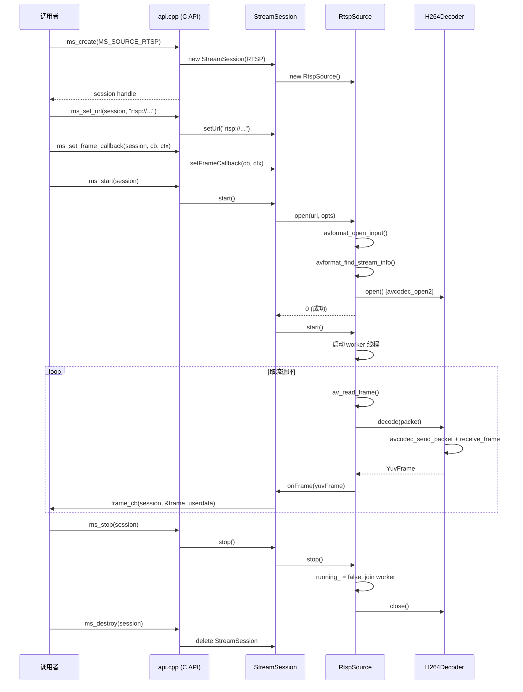
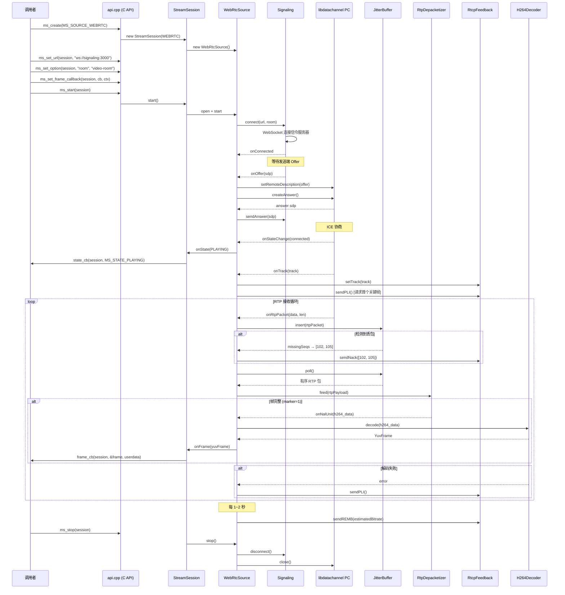
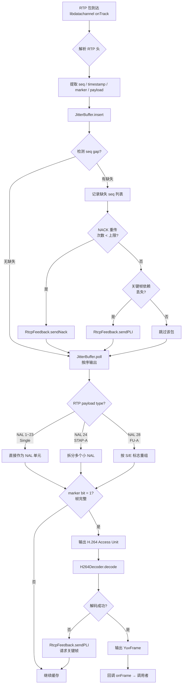

# libmediastream 设计方案

> 日期：2026-02-28
> 定位：跨平台视频取流库（.so / .dll），支持 RTSP + WebRTC 两种取流方式
> 对外提供纯 C 导出接口，内部 C++17 实现
> 开发环境：Windows 验证 → Android 移植

---

## 一、项目目录结构

```
libmediastream/
├── CMakeLists.txt                          # 顶层构建
├── include/
│   └── mediastream.h                       # 唯一对外头文件，纯 C API
├── src/
│   ├── api.cpp                             # C API 实现，桥接内部 C++ 逻辑
│   ├── core/
│   │   ├── IStreamSource.h                 # 取流源抽象接口
│   │   ├── StreamSession.h                 # 会话管理
│   │   ├── StreamSession.cpp
│   │   ├── FrameQueue.h                    # 解码帧无锁队列
│   │   └── Types.h                         # 内部公共类型（YuvFrame 等）
│   ├── rtsp/
│   │   ├── RtspSource.h                    # RTSP 取流实现
│   │   └── RtspSource.cpp
│   ├── webrtc/
│   │   ├── WebRtcSource.h                  # WebRTC 取流实现
│   │   ├── WebRtcSource.cpp
│   │   ├── Signaling.h                     # WebSocket 信令客户端
│   │   ├── Signaling.cpp
│   │   ├── RtpDepacketizer.h               # H.264 RTP 解包组帧
│   │   ├── RtpDepacketizer.cpp
│   │   ├── JitterBuffer.h                  # 简版抖动缓冲
│   │   ├── JitterBuffer.cpp
│   │   ├── RtcpFeedback.h                  # NACK / PLI / FIR / REMB
│   │   └── RtcpFeedback.cpp
│   └── codec/
│       ├── H264Decoder.h                   # FFmpeg 解码封装（两种 Source 共用）
│       └── H264Decoder.cpp
└── test/
    └── main.cpp                            # 测试程序
```

### 目录职责说明

| 目录 | 职责 | 依赖 |
|------|------|------|
| `include/` | 对外唯一公开头文件，纯 C | 无 |
| `src/core/` | 会话管理、抽象接口、公共类型 | 无外部依赖 |
| `src/rtsp/` | RTSP 拉流实现 | FFmpeg |
| `src/webrtc/` | WebRTC 取流 + RTP 管线 + RTCP 反馈 | libdatachannel |
| `src/codec/` | 解码器封装，RTSP 和 WebRTC 共用 | FFmpeg |
| `test/` | 验证测试 | libmediastream |

---

## 二、整体架构图

```
┌─────────────────────────────────────────────────────────────────────┐
│                        外部调用者                                    │
│           (Qt App / Android JNI / Python ctypes / 任意 C 程序)       │
│                                                                     │
│    ms_create()  ms_set_url()  ms_start()  ms_stop()  ms_destroy()  │
└───────────────────────────┬─────────────────────────────────────────┘
                            │ 纯 C API (mediastream.h)
                            ▼
┌─────────────────────────────────────────────────────────────────────┐
│  api.cpp                                                            │
│  ┌────────────────────────────────────────────────────────────┐     │
│  │ ms_session_t  ←→  StreamSession*  类型转换 + 异常捕获      │     │
│  └────────────────────────────────────────────────────────────┘     │
└───────────────────────────┬─────────────────────────────────────────┘
                            │
                            ▼
┌─────────────────────────────────────────────────────────────────────┐
│  StreamSession                                                      │
│  ┌──────────────────────┐   ┌──────────────────────────────────┐   │
│  │ 配置管理              │   │ 回调分发 (frame_cb / state_cb)   │   │
│  │ url, options         │   │ 线程安全保护                      │   │
│  └──────────────────────┘   └──────────────────────────────────┘   │
│                 │                                                    │
│                 │  工厂创建                                          │
│                 ▼                                                    │
│  ┌─────────── IStreamSource (抽象接口) ──────────────┐              │
│  │                                                    │              │
│  ▼                                                    ▼              │
│  ┌──────────────────┐              ┌──────────────────────────┐     │
│  │   RtspSource      │              │    WebRtcSource           │     │
│  │                   │              │                           │     │
│  │ FFmpeg avformat   │              │  Signaling (WebSocket)   │     │
│  │ av_read_frame()   │              │  libdatachannel (ICE/DTLS)│     │
│  │       │           │              │  JitterBuffer            │     │
│  │       ▼           │              │  RtpDepacketizer         │     │
│  │  H264Decoder ◄────┼──── 共用 ───┤  RtcpFeedback            │     │
│  │       │           │              │       │                  │     │
│  │       ▼           │              │       ▼                  │     │
│  │  onFrame(yuv)     │              │  H264Decoder             │     │
│  └──────────────────┘              │       │                  │     │
│                                     │       ▼                  │     │
│                                     │  onFrame(yuv)            │     │
│                                     └──────────────────────────┘     │
└─────────────────────────────────────────────────────────────────────┘
```

---

## 三、类图

```mermaid
classDiagram
    direction TB

    class mediastream_h {
        <<C API - 对外接口>>
        +ms_create(type) ms_session_t
        +ms_destroy(session)
        +ms_set_url(session, url) int
        +ms_set_option(session, key, value) int
        +ms_set_frame_callback(session, cb, userdata)
        +ms_set_state_callback(session, cb, userdata)
        +ms_start(session) int
        +ms_stop(session) int
    }

    class StreamSession {
        -IStreamSource* source_
        -std::string url_
        -Options options_
        -ms_frame_cb frame_cb_
        -ms_state_cb state_cb_
        -void* frame_userdata_
        -void* state_userdata_
        -std::mutex mutex_
        -ms_state state_
        +StreamSession(ms_source_type type)
        +~StreamSession()
        +setUrl(url) int
        +setOption(key, value) int
        +setFrameCallback(cb, userdata)
        +setStateCallback(cb, userdata)
        +start() int
        +stop() int
        +state() ms_state
        -createSource(type) IStreamSource*
        -onFrameReady(YuvFrame&)
        -onStateChanged(State, string)
    }

    class IStreamSource {
        <<interface>>
        +open(url, opts)* int
        +start()* int
        +stop()* void
        +onFrame : function~YuvFrame~
        +onState : function~State, string~
    }

    class RtspSource {
        -AVFormatContext* fmtCtx_
        -AVCodecContext* codecCtx_
        -H264Decoder decoder_
        -std::thread worker_
        -std::atomic_bool running_
        -std::string url_
        +open(url, opts) int
        +start() int
        +stop() void
        -workerLoop()
        -openStream() int
        -freeStream()
    }

    class WebRtcSource {
        -Signaling signaling_
        -rtc::PeerConnection* pc_
        -RtpDepacketizer depacketizer_
        -JitterBuffer jitterBuffer_
        -H264Decoder decoder_
        -RtcpFeedback rtcpFeedback_
        -std::thread decodeWorker_
        -std::atomic_bool running_
        +open(url, opts) int
        +start() int
        +stop() void
        -onTrack(track)
        -onRtpPacket(data, len)
        -decodeLoop()
    }

    class Signaling {
        -rtc::WebSocket* ws_
        -std::string url_
        -std::string room_
        +connect(url, room) int
        +disconnect()
        +sendAnswer(sdp)
        +sendIceCandidate(candidate)
        +onOffer : function~string~
        +onIceCandidate : function~string~
        +onConnected : function~void~
    }

    class RtpDepacketizer {
        -uint16_t lastSeq_
        -uint32_t currentTs_
        -std::vector~uint8_t~ nalBuffer_
        +feed(data, len) void
        +onNalUnit : function~vector~uint8_t~~
        -parseSingleNal(data, len)
        -parseFuA(data, len)
        -parseStapA(data, len)
    }

    class JitterBuffer {
        -std::map~uint16_t, RtpPacket~ buffer_
        -uint16_t nextSeqOut_
        -double jitterEstimate_
        -int targetDelayMs_
        -int minDelay_
        -int maxDelay_
        +insert(packet) void
        +poll() optional~RtpPacket~
        +missingSeqs() vector~uint16_t~
        +reset() void
        -updateJitter(rtpTs, arrivalTime)
    }

    class RtcpFeedback {
        -rtc::Track* track_
        -steady_clock::time_point lastPliTime_
        -steady_clock::time_point lastFirTime_
        -steady_clock::time_point lastRembTime_
        -uint32_t remoteSsrc_
        -uint32_t localSsrc_
        +setTrack(track)
        +sendNack(seqList) void
        +sendPLI() void
        +sendFIR() void
        +sendREMB(bitrate) void
        -buildNackPacket(seqList) vector~uint8_t~
        -buildPliPacket() vector~uint8_t~
        -buildFirPacket() vector~uint8_t~
        -buildRembPacket(bitrate) vector~uint8_t~
    }

    class H264Decoder {
        -AVCodecContext* codecCtx_
        -AVFrame* frame_
        -bool initialized_
        +open() int
        +decode(nalData, len, outFrame) int
        +close() void
        +isOpen() bool
    }

    class YuvFrame {
        <<struct>>
        +uint8_t* y
        +uint8_t* u
        +uint8_t* v
        +int width
        +int height
        +int yStride
        +int uvStride
        +int64_t ptsMs
    }

    mediastream_h --> StreamSession : 桥接
    StreamSession *-- IStreamSource : 持有
    IStreamSource <|.. RtspSource : 实现
    IStreamSource <|.. WebRtcSource : 实现
    RtspSource *-- H264Decoder : 共用
    WebRtcSource *-- Signaling
    WebRtcSource *-- RtpDepacketizer
    WebRtcSource *-- JitterBuffer
    WebRtcSource *-- RtcpFeedback
    WebRtcSource *-- H264Decoder : 共用
    RtpDepacketizer ..> JitterBuffer : 输入包
    JitterBuffer ..> RtcpFeedback : 丢包列表
    H264Decoder ..> YuvFrame : 输出
```



---

## 四、流程图

### 4.1 RTSP 取流时序



### 4.2 WebRTC 取流时序



### 4.3 WebRTC RTP 接收管线详细流程



---

## 五、对外 C API 定义

```c
#ifndef MEDIASTREAM_H
#define MEDIASTREAM_H

#ifdef __cplusplus
extern "C" {
#endif

#ifdef _WIN32
  #ifdef MEDIASTREAM_EXPORTS
    #define MS_API __declspec(dllexport)
  #else
    #define MS_API __declspec(dllimport)
  #endif
#else
  #define MS_API __attribute__((visibility("default")))
#endif

/* ========== 类型定义 ========== */

typedef void* ms_session_t;

typedef enum {
    MS_SOURCE_RTSP   = 0,
    MS_SOURCE_WEBRTC = 1,
} ms_source_type;

typedef enum {
    MS_STATE_STOPPED    = 0,
    MS_STATE_CONNECTING = 1,
    MS_STATE_PLAYING    = 2,
    MS_STATE_ERROR      = 3,
} ms_state;

typedef struct {
    const uint8_t* y;
    const uint8_t* u;
    const uint8_t* v;
    int width;
    int height;
    int y_stride;
    int uv_stride;
    int64_t pts_ms;
} ms_frame;

/* ========== 回调定义 ========== */

typedef void (*ms_frame_cb)(ms_session_t session,
                            const ms_frame* frame,
                            void* userdata);

typedef void (*ms_state_cb)(ms_session_t session,
                            ms_state state,
                            const char* msg,
                            void* userdata);

/* ========== 生命周期 ========== */

MS_API ms_session_t ms_create(ms_source_type type);
MS_API void         ms_destroy(ms_session_t session);

/* ========== 配置 ========== */

MS_API int  ms_set_url(ms_session_t session, const char* url);
MS_API int  ms_set_option(ms_session_t session,
                          const char* key,
                          const char* value);

/* ========== 回调注册 ========== */

MS_API void ms_set_frame_callback(ms_session_t session,
                                  ms_frame_cb cb,
                                  void* userdata);
MS_API void ms_set_state_callback(ms_session_t session,
                                  ms_state_cb cb,
                                  void* userdata);

/* ========== 控制 ========== */

MS_API int  ms_start(ms_session_t session);
MS_API int  ms_stop(ms_session_t session);

/* ========== 辅助 ========== */

MS_API const char* ms_version(void);
MS_API const char* ms_state_name(ms_state state);

#ifdef __cplusplus
}
#endif

#endif /* MEDIASTREAM_H */
```

### option key 约定

| key | 适用 | 说明 | 示例 value |
|-----|------|------|-----------|
| `"room"` | WebRTC | 信令房间名 | `"video-room"` |
| `"transport"` | RTSP | 传输协议 | `"tcp"` / `"udp"` |
| `"timeout"` | 全局 | 连接超时 (ms) | `"5000"` |
| `"max_delay"` | RTSP | 最大解复用延迟 (μs) | `"500000"` |
| `"jitter_min"` | WebRTC | JitterBuffer 最小延迟 (ms) | `"20"` |
| `"jitter_max"` | WebRTC | JitterBuffer 最大延迟 (ms) | `"100"` |
| `"nack_max_retry"` | WebRTC | 单包最大 NACK 次数 | `"3"` |
| `"hw_decode"` | 全局 | 硬解码开关 | `"1"` / `"0"` |

---

## 六、核心类接口设计

### 6.1 IStreamSource — 取流源抽象接口

```cpp
// core/IStreamSource.h
#pragma once
#include "Types.h"
#include <functional>
#include <string>
#include <unordered_map>

using Options = std::unordered_map<std::string, std::string>;

class IStreamSource {
public:
    virtual ~IStreamSource() = default;

    virtual int  open(const std::string& url, const Options& opts) = 0;
    virtual int  start() = 0;
    virtual void stop()  = 0;

    std::function<void(const YuvFrame&)>             onFrame;
    std::function<void(StreamState, const std::string&)> onState;
};
```

### 6.2 StreamSession — 会话管理

```cpp
// core/StreamSession.h
#pragma once
#include "IStreamSource.h"
#include "mediastream.h"
#include <memory>
#include <mutex>

class StreamSession {
public:
    explicit StreamSession(ms_source_type type);
    ~StreamSession();

    int  setUrl(const char* url);
    int  setOption(const char* key, const char* value);
    void setFrameCallback(ms_frame_cb cb, void* userdata);
    void setStateCallback(ms_state_cb cb, void* userdata);

    int  start();
    int  stop();
    ms_state state() const;

private:
    std::unique_ptr<IStreamSource> source_;
    std::string url_;
    Options options_;

    ms_frame_cb  frameCb_  = nullptr;
    void*        frameUd_  = nullptr;
    ms_state_cb  stateCb_  = nullptr;
    void*        stateUd_  = nullptr;

    ms_state state_ = MS_STATE_STOPPED;
    mutable std::mutex mutex_;

    static std::unique_ptr<IStreamSource> createSource(ms_source_type type);
    void onFrameReady(const YuvFrame& frame);
    void onStateChanged(StreamState st, const std::string& msg);
};
```

### 6.3 H264Decoder — FFmpeg 解码封装

```cpp
// codec/H264Decoder.h
#pragma once
#include "core/Types.h"

struct AVCodecContext;
struct AVFrame;

class H264Decoder {
public:
    H264Decoder();
    ~H264Decoder();

    int  open();
    void close();
    bool isOpen() const;

    // 送入一个完整 NAL Unit / Access Unit，成功解码时填充 outFrame 并返回 0
    int  decode(const uint8_t* data, int size, YuvFrame& outFrame);

private:
    AVCodecContext* ctx_   = nullptr;
    AVFrame*        frame_ = nullptr;
    bool            open_  = false;
};
```

---

## 七、线程模型

```
┌─────────────────────────────────────────────────────────┐
│                     线程架构                             │
├─────────────────────────────────────────────────────────┤
│                                                         │
│  [调用者线程]                                            │
│    ms_create / ms_start / ms_stop / ms_destroy          │
│    回调函数在内部线程触发，调用者自行决定是否转发到 UI    │
│                                                         │
│  ──── RTSP 模式 ────                                    │
│                                                         │
│  [Worker 线程]  (RtspSource 内部)                        │
│    avformat_open_input                                  │
│    loop:                                                │
│      av_read_frame → H264Decoder::decode → onFrame()    │
│                                                         │
│  ──── WebRTC 模式 ────                                  │
│                                                         │
│  [libdatachannel 网络线程]  (库内部管理)                  │
│    ICE / DTLS / SRTP 解密                               │
│    onTrack 回调 → 投递 RTP 包到解码线程                  │
│                                                         │
│  [Decode 线程]  (WebRtcSource 内部)                      │
│    JitterBuffer.insert(pkt)                             │
│    JitterBuffer.poll() → RtpDepacketizer → 组帧         │
│    H264Decoder.decode() → onFrame()                     │
│    NackGenerator 检测丢包 → RtcpFeedback.sendNack()     │
│                                                         │
│  [RTCP 定时器]  (WebRtcSource 内部, 可合并到 Decode 线程) │
│    每 1~2s: sendREMB()                                  │
│    按需:   sendPLI() / sendFIR()                        │
│                                                         │
└─────────────────────────────────────────────────────────┘

线程间通信:
  libdatachannel 线程 → Decode 线程 : lock-free queue (RTP packets)
  Decode 线程 → 调用者 : 直接回调 onFrame (调用者自行处理线程安全)
```

---

## 八、调用者集成示例

### 8.1 C 调用示例

```c
#include "mediastream.h"
#include <stdio.h>

void on_frame(ms_session_t s, const ms_frame* f, void* ud) {
    printf("frame: %dx%d pts=%lld\n", f->width, f->height, f->pts_ms);
    // 拿到 YUV 数据后渲染或转发
}

void on_state(ms_session_t s, ms_state st, const char* msg, void* ud) {
    printf("state: %s %s\n", ms_state_name(st), msg ? msg : "");
}

int main() {
    // RTSP 方式
    ms_session_t s = ms_create(MS_SOURCE_RTSP);
    ms_set_url(s, "rtsp://192.168.1.100:8554/live");
    ms_set_option(s, "transport", "tcp");
    ms_set_frame_callback(s, on_frame, NULL);
    ms_set_state_callback(s, on_state, NULL);
    ms_start(s);

    getchar(); // 等待

    ms_stop(s);
    ms_destroy(s);
    return 0;
}
```

### 8.2 Qt 集成示例

```cpp
// Qt 端只需链接 libmediastream，不需要 FFmpeg/libdatachannel 头文件
#include "mediastream.h"

class VideoWidget : public QQuickPaintedItem {
    Q_OBJECT
public:
    VideoWidget() {
        session_ = ms_create(MS_SOURCE_RTSP);
        ms_set_frame_callback(session_, &VideoWidget::frameCallback, this);
        ms_set_state_callback(session_, &VideoWidget::stateCallback, this);
    }

    ~VideoWidget() {
        ms_stop(session_);
        ms_destroy(session_);
    }

    Q_INVOKABLE void startPlay(const QString& url) {
        ms_set_url(session_, url.toUtf8().constData());
        ms_start(session_);
    }

    Q_INVOKABLE void stopPlay() {
        ms_stop(session_);
    }

private:
    ms_session_t session_;

    static void frameCallback(ms_session_t, const ms_frame* f, void* ud) {
        auto self = static_cast<VideoWidget*>(ud);
        // 转到 Qt 主线程渲染
        QMetaObject::invokeMethod(self, [self, frame = *f]() {
            self->renderFrame(frame);
        }, Qt::QueuedConnection);
    }

    static void stateCallback(ms_session_t, ms_state st, const char* msg, void* ud) {
        auto self = static_cast<VideoWidget*>(ud);
        QMetaObject::invokeMethod(self, [self, st]() {
            // 更新 UI 状态
        }, Qt::QueuedConnection);
    }

    void renderFrame(const ms_frame& f) {
        // sws_scale or 直接 QImage 渲染
        update();
    }
};
```

---

## 九、构建系统 CMakeLists.txt

```cmake
cmake_minimum_required(VERSION 3.16)
project(mediastream VERSION 1.0.0 LANGUAGES C CXX)

set(CMAKE_CXX_STANDARD 17)
set(CMAKE_CXX_STANDARD_REQUIRED ON)

# 隐藏所有符号，只暴露 MS_API 标记的
set(CMAKE_CXX_VISIBILITY_PRESET hidden)
set(CMAKE_VISIBILITY_INLINES_HIDDEN ON)

# ---- 依赖 ----
find_package(PkgConfig REQUIRED)
pkg_check_modules(FFMPEG REQUIRED
    libavformat libavcodec libavutil libswscale)

# libdatachannel (仅 WebRTC 需要，可选编译)
option(ENABLE_WEBRTC "Build with WebRTC support" ON)
if(ENABLE_WEBRTC)
    add_subdirectory(third_party/libdatachannel EXCLUDE_FROM_ALL)
    add_compile_definitions(MS_ENABLE_WEBRTC)
endif()

# ---- 源文件 ----
set(CORE_SOURCES
    src/api.cpp
    src/core/StreamSession.cpp
)

set(RTSP_SOURCES
    src/rtsp/RtspSource.cpp
)

set(WEBRTC_SOURCES
    src/webrtc/WebRtcSource.cpp
    src/webrtc/Signaling.cpp
    src/webrtc/RtpDepacketizer.cpp
    src/webrtc/JitterBuffer.cpp
    src/webrtc/RtcpFeedback.cpp
)

set(CODEC_SOURCES
    src/codec/H264Decoder.cpp
)

set(ALL_SOURCES ${CORE_SOURCES} ${RTSP_SOURCES} ${CODEC_SOURCES})
if(ENABLE_WEBRTC)
    list(APPEND ALL_SOURCES ${WEBRTC_SOURCES})
endif()

# ---- 构建目标 ----
add_library(mediastream SHARED ${ALL_SOURCES})

target_compile_definitions(mediastream PRIVATE MEDIASTREAM_EXPORTS)

target_include_directories(mediastream
    PUBLIC  include
    PRIVATE src
    PRIVATE ${FFMPEG_INCLUDE_DIRS}
)

target_link_libraries(mediastream PRIVATE ${FFMPEG_LIBRARIES})
if(ENABLE_WEBRTC)
    target_link_libraries(mediastream PRIVATE LibDataChannel::LibDataChannel)
endif()

# ---- 测试 ----
add_executable(mediastream_test test/main.cpp)
target_link_libraries(mediastream_test PRIVATE mediastream)
```

---

## 十、开发计划

```
Phase 1 — 基础骨架 (Week 1)
├─ 搭建 CMake 工程 + 目录结构
├─ 实现 C API 桥接层 (api.cpp)
├─ 实现 StreamSession + IStreamSource 抽象
├─ 实现 RtspSource (从现有 MediaService 迁移)
├─ 实现 H264Decoder
└─ 验证: RTSP 取流 → 回调拿到 YUV 帧

Phase 2 — WebRTC 基础 (Week 2~3)
├─ 实现 Signaling (WebSocket 信令)
├─ 实现 WebRtcSource (libdatachannel PeerConnection)
├─ 实现 RtpDepacketizer (H.264 FU-A/STAP-A/Single)
└─ 验证: WebRTC 连接 → 解码 → 回调拿到 YUV 帧

Phase 3 — WebRTC 优化 (Week 3~5)
├─ 实现 JitterBuffer (自适应延迟)
├─ 实现 NACK 重传
├─ 实现 PLI / FIR 关键帧请求
├─ 实现 FEC 解码 (框架 + 预留)
├─ 实现 REMB 拥塞反馈
└─ 验证: 模拟丢包/抖动场景下稳定播放

Phase 4 — 集成与移植 (Week 5~6)
├─ Qt 端集成测试 (替换现有 MediaService)
├─ 性能调优 (延迟 / CPU / 内存)
├─ Android NDK 交叉编译
└─ Android MediaCodec 硬解适配
```

---

## 十一、与现有代码的迁移关系

```
现有代码                              libmediastream
──────────────────────────────────    ──────────────────────────────
MediaService.openFfmpegStream()   →   RtspSource.openStream()
MediaService.demuxing()           →   RtspSource.workerLoop()
MediaService.decodeFrame()        →   H264Decoder.decode()
MediaService.freeFfmpegCtx()      →   RtspSource.freeStream()
MediaService 状态机                →   StreamSession 状态管理
MediaService.YuvData              →   ms_frame (C struct)
MediaService.updateFrame 信号     →   ms_frame_cb 回调
MediaControl (多路管理)            →   调用者自行管理多个 ms_session_t
screenShot / recordVideo          →   不在库内，调用者拿到帧后自行处理
Android 硬解 (MediaCodec)         →   H264Decoder 内部 #ifdef __ANDROID__
```

